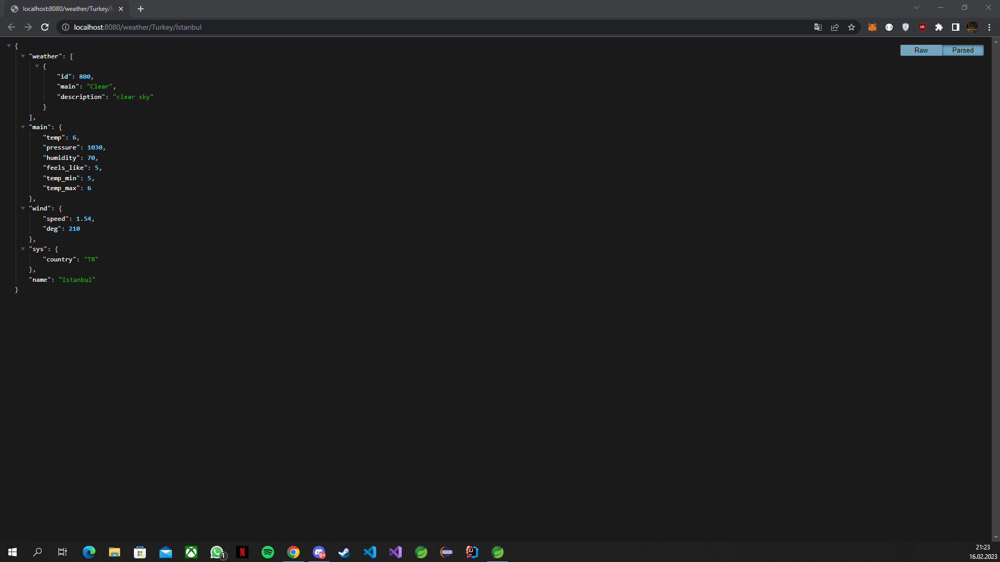
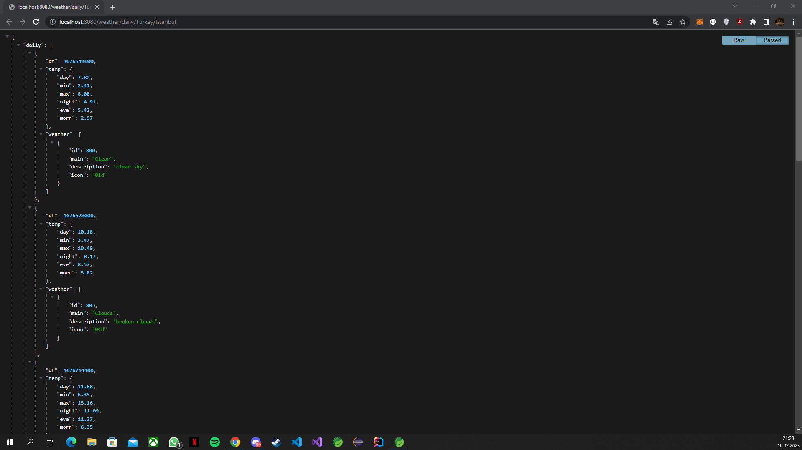
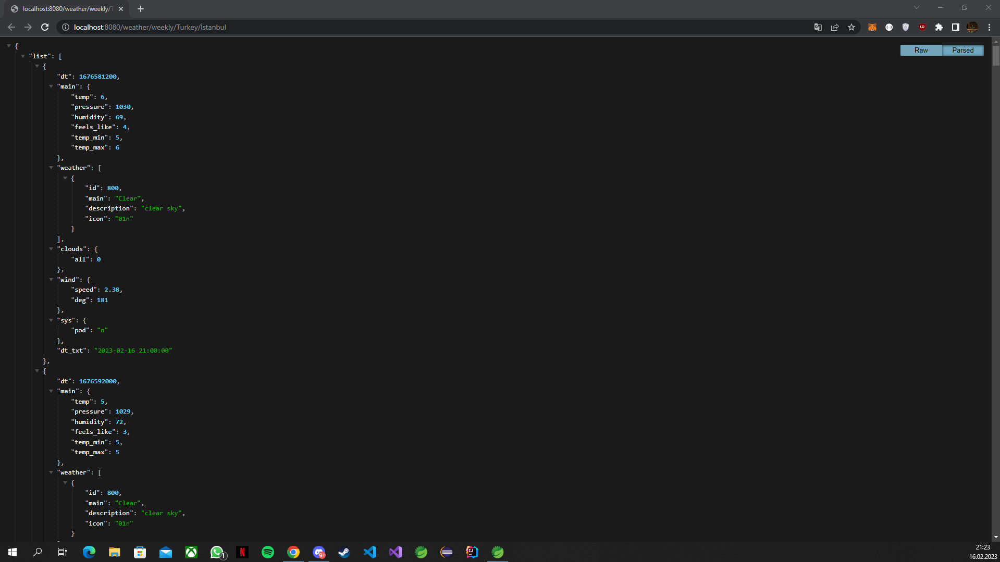

# Weather Api HomeWork

# Homework Steps

- We're going to make a weather API. There are lots of free APIs on the internet for this. There are some API websites below. I used openweathermap.org. You can use other APIs if you wish.

- https://openweathermap.org/api
- https://www.weatherapi.com/
- https://weatherstack.com/

- Our main goal is to write an API to communicate with these APIs. Let's show the daily, weekly and monthly weather report according to the country / city information that we will get from the user. ( I only implemented the daily and weekly weather reports because OpenWeatherMap API does not provide a monthly forecast.)

- The request will first come to the API you will write, then after you receive the request, you will request the Free Weather APIs and return this information.

- I used the RestTemplate class for this process.

# Output Images

